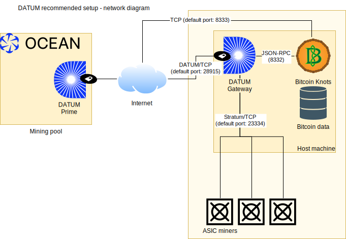

# DATUM Gateway
**Decentralized Alternative Templates for Universal Mining**
(c) 2024-2025 Bitcoin Ocean, LLC, Jason Hughes, and individual contributors

The DATUM Gateway implements lightweight efficient client side decentralized block template creation for true solo mining.

It reaches out to a local Bitcoin node for block templates, generates and distributes work for mining hardware, and submits solved blocks to the network directly.

For miners wanting to pool rewards, it facilitates communication with a DATUM-supporting pool in addition to the above.  The pool is responsible for coordinating the block reward split based on work done for the pool by the miner, but does not create work for the miner.

The work provided by the gateway to mining hardware is generated only from the local node generating templates for the miner. The real miner is always whoever is running the Bitcoin node. With DATUM, that's not the pool. As the protocol is intended solely for mining of decentralized block templates, the DATUM protocol has no mechanisms for the pool providing the information needed to construct work or a block template.

Currently the DATUM Gateway supports communication with mining hardware using the Stratum v1 protocol with version rolling extensions (aka "ASICBoost").  Communication with the Bitcoin node is via RPC and must support GBT ("getblocktemplate").  Finally, communication with the pool is via the DATUM protocol.

**Using Bitcoin Knots is highly recommended**. This gives miners fine controls over how they wish to construct their block templates.  Other node implementations that support GBT can also be used.  This includes Bitcoin Core, but it is severely lacking in template control options.  That is unfortunately a centralizing force which partly defeats the purpose of decentralizing block template creation in the first place.

The DATUM Gateway only supports mining Bitcoin.  Modifying the code to support non-Bitcoin is not straightforward, as many optimizations and design considerations are tightly tied to Bitcoin-specific restraints for efficiency.

## DATUM Protocol
The DATUM Gateway's communication with the mining pool is via the DATUM Protocol.  This is an encrypted communication link between the DATUM Gateway (client) and DATUM Prime (pool side).

The protocol itself was made from the ground up as a custom protocol.  Its specification is evolving, subject to change, and will be published elsewhere.

The core concepts of the protocol:

 - Encrypt communications between the Gateway and pool
 - Obfuscate the communications somewhat so a MITM is unable to glean useful or accurate insight into the miner's operation via analysis of the still-ciphered communications.
 - Retrieve proper generation transaction payout splits from the pool for locally constructed templates
 - Submit work to the pool with sufficient data to efficiently validate and accept the work for proper rewards
 - Communicate minimal guardrails and requirements for a valid template to earn pooled rewards

With the current version of the protocol, the pool does block validation after coordinating with the miner. This is strictly to ensure miners are not accidentally creating invalid blocks while DATUM is still undergoing testing. In a future version of the protocol, the pool will not be in charge of this function and will be almost completely blinded to the contents of the miner's block template.

The protocol is not specific to a pooled reward system, as the Gateway coordinates the appropriate generation transaction with the pool.  However, in the spirit of maximum decentralization, the pool should implement rewarding miners directly from generated payouts, such as with OCEAN's TIDES reward system.



## Requirements

 - 64-bit AMD or Intel system. Other systems may work, but at this time it is at your own risk.
 - Linux-based operating system. Other OSs will be supported in the future.
 - Bitcoin full node ([Bitcoin Knots](https://bitcoinknots.org/) recommended) fully synced with the Bitcoin network.
 - Fast storage recommended for the Bitcoin node.
 - Stable internet connection for both the Bitcoin node and Gateway's communication with the pool.
 - CPU powerful enough to run the Bitcoin node without validation delays.
 - Approximately 1GB/RAM, plus 1GB/RAM per 1000 Stratum clients, plus Bitcoin node RAM requirements.
 - Bitcoin mining hardware able to reach the system running the DATUM Gateway.

This list is not extensive, but the main goal is the have a stable system for your Bitcoin node and the Gateway such that your node is processing new incoming blocks and getting templates to the Gateway as quickly as possible.  While this may all work on relatively low end hardware, your mileage may vary.

No modifications to the Bitcoin node source code is required for the Gateway, as it uses the standard GBT mechanism for template fetch.

The following external libraries are required:
 - libcurl
 - libjansson
 - libmicrohttpd
 - libsodium

## Node Configuration
Your Bitcoin node must be configured to construct blocks as you desire.  Bitcoin Knots provides many options for configuring your node's policy and is highly recommended.

At this time, you must also reserve some block space for the pool's generation transaction.  The following options are currently recommended:

    blockmaxsize=3985000
    blockmaxweight=3985000

Note: This reservation requirement will be removed for Bitcoin Knots users in a future version of the DATUM Gateway thanks to support for on-the-fly specification of these metrics by the client in Knots.

To avoid mining stale work, you will need to ensure the DATUM Gateway receives new block notifications from your node. It is suggested you run the DATUM Gateway as the same user as your full node and utilize the following configuration line in your bitcoin.conf:

    blocknotify=killall -USR1 datum_gateway

Ensure you have "killall" installed on your system (*psmisc* package on many OSs).

If the node and Gateway are on different systems, you may need to utilize the "NOTIFY" endpoint on the Gateway's dashboard/API instead.

Finally, the Gateway must have RPC access to your node, and you must add an RPC user to your configuration to facilitate this, as well as ensuring the service running the Gateway is whitelisted for RPC access (if not on the same machine).

Some additional recommendations:

    maxmempool=1000
    blockreconstructionextratxn=1000000

As a true miner, you'll most likely want as many valid transactions as possible in your mempool which meet your node's policies.

## Installation
Install and fully sync your Bitcoin full node. Instructions for this are beyond the scope of this document.

Configure your node to create block templates as you desire. Be sure to reserve some space for the generation transaction, otherwise your work will not be able to fit a reward split.  See node configuration recommendations above.

Install the required libraries and development packages for dependencies: cmake, pkgconf, libcurl, jansson, libsodium, and libmicrohttpd. You may also need psmisc for your node to send blocknotify signals to the DATUM Gateway.

For Debian/Ubuntu:

    sudo apt install cmake pkgconf libcurl4-openssl-dev libjansson-dev libsodium-dev libmicrohttpd-dev psmisc

For Fedora/Amazon Linux:

    sudo dnf install cmake pkgconf libcurl-devel jansson-devel libsodium-devel libmicrohttpd-devel psmisc

For Alma Linux:

    sudo dnf install epel-release dnf-plugins-core
    sudo dnf config-manager --set-enabled crb
    sudo dnf install cmake pkgconf libcurl-devel jansson-devel libsodium-devel libmicrohttpd-devel psmisc

For Oracle Linux:

    sudo dnf install epel-release dnf-plugins-core
    sudo dnf config-manager --set-enabled ol9_codeready_builder
    sudo dnf install cmake pkgconf libcurl-devel jansson-devel libsodium-devel libmicrohttpd-devel psmisc

For Alpine (also needs a standalone argp library):

    sudo apk add build-base cmake pkgconf argp-standalone curl-dev jansson-dev libsodium-dev libmicrohttpd-dev psmisc

For Arch:

    sudo pacman -Syu base-devel cmake pkgconf curl jansson libsodium libmicrohttpd psmisc

For Clear Linux:

    sudo swupd bundle-add c-basic cmake pkgconf devpkg-curl devpkg-jansson devpkg-libsodium devpkg-libmicrohttpd psmisc

For FreeBSD:

    sudo pkg install cmake pkgconf curl jansson libsodium libmicrohttpd argp-standalone libepoll-shim

Compile DATUM by running:

    cmake . && make

## Usage

Run the datum_gateway executable with the -? flag for detailed configuration information, descriptions, and required options.  Then construct a configuration file (defaults to "datum_gateway_config.json" in the current working directory). Be sure to also set your coinbase tags.  The primary tag setting is unused in pooled mining, however the secondary tag is intended to show on things like block explorers when you mine a block.

There is an [example configuration file included in the doc/ directory](doc/example_datum_gateway_config.json) you may wish to use as a template.
Note that the API/web admin password is also used for preventing CSRF attacks, so it is crucial you set it to something reasonably secure (or disable the API/web interface entirely).

You should review the [documentation on usernames](doc/usernames.md) next.
Once you have everything running, you can point miners at the Gateway.

## Docker

The DATUM Gateway is also available as a Docker image.


### Building the Docker Image

To build the DATUM Gateway Docker image:

```bash
# From the root of the repository
docker build -t datum_gateway .
```

### Running the Container

To run the DATUM Gateway container:

```bash
# Run with default configuration
docker run -p 23334:23334 -p 7152:7152 --name datum-gateway datum_gateway
```

The container expects a configuration file at `/app/config/config.json`. Mount a volume to this path to use your own configuration:

```bash
docker run -v /path/to/your/config/directory:/app/config -p 23334:23334 -p 7152:7152 datum_gateway
```

You will need to disable the notify fallback in your configuration file if you are using Docker. And in bitcoin.conf, you will need to set the following:

```bash
blocknotify=wget -q -O /dev/null http://datum-gateway:7152/NOTIFY
```

### Connecting to a Bitcoin Node

When running the DATUM Gateway in Docker, you need to configure it to connect to your Bitcoin node. The connection method depends on where your Bitcoin node is running:

#### 1. Bitcoin Node Running in Docker (Same Network)

If your Bitcoin node is also running in a Docker container on the same network, use the container name as the hostname:

```json
{
  "rpc_host": "bitcoin-node",
  "rpc_port": 8332,
  "rpc_user": "your_rpc_user",
  "rpc_pass": "your_rpc_password"
}
```

In your `bitcoin.conf`, set the blocknotify to use the DATUM Gateway container name:

```
blocknotify=wget -q -O /dev/null http://datum-gateway:7152/NOTIFY
```

#### 2. Bitcoin Node Running on Host System

If your Bitcoin node is running directly on the host system or in a container that binds to host ports, you have two options:

**Option A: Using host.docker.internal (recommended)**
```json
{
  "rpc_host": "host.docker.internal",
  "rpc_port": 8332,
  "rpc_user": "your_rpc_user",
  "rpc_pass": "your_rpc_password"
}
```

**Option B: Using host networking mode**
Run the DATUM Gateway container with `--network host`:

```bash
docker run --network host -v /path/to/config:/app/config datum_gateway
```

Then configure using localhost:
```json
{
  "rpc_host": "localhost",
  "rpc_port": 8332,
  "rpc_user": "your_rpc_user",
  "rpc_pass": "your_rpc_password"
}
```

For blocknotify in `bitcoin.conf` when using host networking:
```
blocknotify=wget -q -O /dev/null http://localhost:7152/NOTIFY
```

#### 3. Bitcoin Node on Remote System

If your Bitcoin node is running on a different machine, use the hostname or IP address:

```json
{
  "rpc_host": "192.168.1.100",
  "rpc_port": 8332,
  "rpc_user": "your_rpc_user",
  "rpc_pass": "your_rpc_password"
}
```

In your remote Bitcoin node's `bitcoin.conf`:
```
blocknotify=wget -q -O /dev/null http://datum-gateway-host-ip:7152/NOTIFY
```

**Important Notes:**
- Ensure your Bitcoin node's RPC is configured to accept connections from the DATUM Gateway
- For remote connections, you may need to configure `rpcbind` and `rpcallowip` in your `bitcoin.conf`
- Always use strong RPC credentials and consider network security when exposing RPC endpoints
- Remember to disable the notify fallback in your DATUM Gateway configuration when using Docker

## Template/Share Requirements for Pooled Mining

 - Must be a valid block and conform to current Bitcoin consensus rules
 - Submitted work must be for the current latest block height, valid time, etc
 - Must include generation transaction outputs provided by the pool in the order provided
 - Must include the primary coinbase tag as provided by the pool
 - Must include the unique identifier provided by the pool
 - Work must include the work target and meet/exceed that target
 - Any additional requirements by pool documentation

## Notes/Known Issues/Limitations

- By default, if the connection with the pool is lost and fails to reconnect, the Gateway will disconnect all stratum clients. This way miners can use their built-in failover and switch to non-DATUM mining, or an alternate/backup Gateway.
- Accepted/rejected share counts on mining hardware may not perfectly match with the pool. The delta may vary depending on the Gateway's configuration. This is because shares are first accepted or rejected as valid for your local template based on your local node, and then again accepted or rejected based on the pool's requirements, latency to the pool (stale work), latency between your node and the network (stale work), etc.  Stratum v1 has no mechanism to report back to the miner that previously accepted work is now rejected, and it doesn't make sense to wait for the pool before responding, either.

**Most importantly**, please note that this is currently a public **BETA** release. While best efforts have been made to ensure this software is as stable and as useful as possible, you may still encounter issues.

This software is likely to undergo rapid development and revisions up until a v1.0 stable release. Some of these revisions may include changes, such as protocol changes, that require upgrading to the latest version with short or even no notice in order to continue using the software with a DATUM pool. Be sure to watch for important updates!

Be sure you have failover settings on your miners. As a best practice, when mining on a DATUM pool, set your miner's failover to use that pool's Stratum endpoint.

## License

The DATUM Gateway (including the DATUM Protocol) is free open source software and released under the terms of the MIT license.  See LICENSE.
